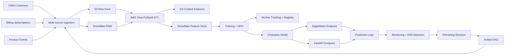

# Architecture

## Overview

This platform implements an end-to-end churn prediction lifecycle for a subscription company. It separates raw data ingestion, curated feature processing, model training, model serving, monitoring, and retraining so each concern can scale independently.

## Data Plane

Customer CRM, billing, and product event sources are landed into the raw zone through `data_ingestion`. AWS Glue executes the PySpark feature engineering job for production-scale processing. Snowflake stores raw audit tables, offline feature tables, online-serving feature snapshots, and monitoring outputs.

## ML Plane

The training package builds a model-ready frame, runs hyperparameter optimization for classical models, logs metrics and artifacts to MLflow, and selects the champion by ROC AUC. Deep learning model definitions are included for TensorFlow and PyTorch extension paths, while the default local tests keep dependencies lightweight.

## Serving Plane

Champion model artifacts are deployed to SageMaker for managed production inference. The FastAPI service provides a local and containerized REST endpoint compatible with the same model artifact contract.

## Monitoring Plane

Monitoring jobs compare reference and current feature distributions with PSI, evaluate prediction distribution shifts, and track accuracy degradation once delayed labels arrive. A retraining policy emits explicit reasons for Airflow-triggered retraining.

## Architecture Diagram

## Data Contracts

Primary entity: `customer_id`

Target: `churned`

Core feature families:

- Revenue: monthly recurring revenue and revenue normalized by engagement.
- Tenure: days since signup.
- Engagement: total events, active days, feature usage.
- Support and billing friction: support-ticket rate and payment-failure rate.
- Subscription posture: billing interval, renewal setting, and status.

## Production Concerns

- Use S3 object versioning and immutable raw paths for reproducibility.
- Store feature creation timestamps to support point-in-time training.
- Track every training run with params, metrics, artifacts, and data version.
- Keep champion promotion gated by metric thresholds and human approval when needed.
- Monitor both statistical drift and realized business impact.

